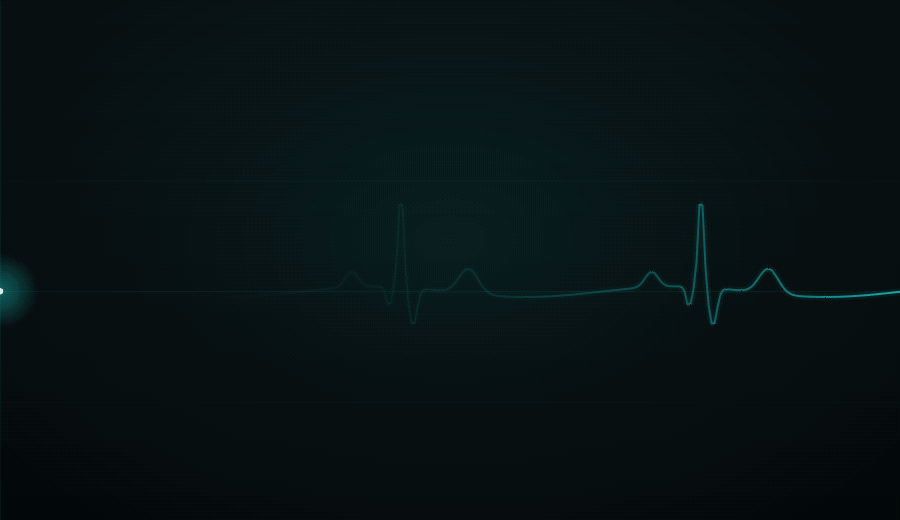

<p align="center">
  
</p>

**DNPScop Slave** is a free **DNP3 (IEEE 1815) outstation simulator** with a
modern, dockable **Dear ImGui** interface — a companion to ModbusScop Master and
Slave, sharing their look and feel. It emulates **many DNP3 outstations at once**
over **TCP**, **UDP**, and **serial** channels, so engineers can test, commission,
and troubleshoot DNP3 masters and SCADA systems without real field hardware.

The complete DNP3 stack — link, transport, and application layers — is
**hand-rolled over Asio**, with no third-party protocol library.

Free to use and redistribute under the permissive **BSD 2-Clause License**.

Developed by **Carlos Nardi**.

[](https://buymeacoffee.com/cnardi)

<p align="center">
  
</p>

## Concept

DNPScop Slave is organized as a tree: **Channels → Outstations → Point groups**.

- A **Channel** is one server endpoint: a **TCP** listener (serving several
  masters at once, up to a configurable limit), a **UDP** datagram server, or a
  **Serial** line carrying DNP3 link frames. Each channel runs on its own I/O
  thread; start and stop them independently.
- An **Outstation** is one simulated device with its own **link address** behind a
  channel. A channel can host many outstations; each frame is routed to the
  outstation whose link address matches (with an optional catch-all).
- Each outstation carries a full **point database** — Binary/Double-bit Inputs,
  Binary/Analog Outputs, Analog Inputs, Counters and Frozen Counters — editable
  directly in the UI, each point with its own static and event variations.

## Features

- **Complete hand-rolled DNP3 stack** over Asio (no third-party DNP3 library):
  link layer with per-block CRCs, transport segmentation/reassembly, and the
  application layer with the full object/qualifier codec.
- **TCP, UDP, and Serial channels** — serve masters over DNP3-over-TCP,
  DNP3-over-UDP, or a serial line, chosen per channel. DNP3's self-framing link
  layer means the same engine deframes a stream, a datagram, or a serial line
  identically.
- **Multi-outstation, multi-master** — many channels, each with many outstations
  on distinct link addresses; TCP channels serve multiple masters concurrently.
- **Full point model** — Binary Inputs, Double-bit Binary Inputs, Binary Outputs,
  Analog Inputs, Analog Outputs, Counters and Frozen Counters, with per-point
  static and event variations.
- **Reads, classes, and events** — static reads (Class 0) and event reads
  (Classes 1/2/3) served from per-class **event buffers** with configurable
  overflow policy; integrity polls and enable/disable unsolicited.
- **Unsolicited responses** — outstations push events to connected masters as
  they occur, with confirmation handling.
- **Controls + glue logic** — CROB (Trip/Close, pulse/latch) and analog-output
  operate/select; map an operated control to a point action so commanding an
  output drives the matching input, and pass analog-output setpoints through to
  analog inputs.
- **Per-point simulation** — Sine, Ramp, Random, Counter, Toggle, and double-bit
  state walk, constrained by each point's type and paced per point.
- **Time & Date** — System or Manual time source, Local / UTC display with a
  DST-aware offset, and a per-outstation GMT offset applied on the wire.
- **Communication Monitor** — a timestamped, filterable log of every frame with a
  layered link/transport/application decode, per master and per outstation.
- **Status Messages & Dashboard** — channel start/stop and master
  connect/disconnect events, plus live per-channel traffic counters and uptime.
- **Workspaces** — save and reload your entire setup: channels (including
  transport), outstations, points, values, variations, glue logic, and
  simulations.
- **Themes** — dark / light / classic with a customizable accent color; layout
  and preferences are remembered between runs.


## Download & run

1. Go to the [**Releases**](../../releases) page and download the latest
   `DNPScopSlave` archive for Windows.
2. Unzip it anywhere and run **`DNPScopSlave.exe`** — no installation required.

**Requirements:** Windows 10/11 (64-bit).

**Rendering:** DNPScop Slave uses the GPU by default; you can switch to **CPU
(software)** rendering under **View → Rendering** (handy over Remote Desktop or in
VMs).

### Getting started

1. **New Channel** — choose **TCP** or **UDP**, set the bind IP and port (DNP3
   commonly uses 20000), and — for TCP — the maximum number of masters. Or use
   **New Serial Channel** for a serial line. Each new channel starts with one
   outstation (link 1).
2. **Add outstation** — add more outstations, each with its own link address.
3. Edit the outstation's points — set values, variations, controls/glue, and
   per-point simulation.
4. Press **Start** on the channel and point your DNP3 master at the endpoint.
   Watch the frames decode in the **Communication Monitor** and the counters in
   the **Dashboard**.

Use **File → Save Workspace** to keep the whole configuration and reload it later.

## Third-party libraries

DNPScop Slave is built with these open-source components, each under its own
license:

| Library | Used for | License |
|---------|----------|---------|
| Dear ImGui (docking) | user interface | MIT |
| GLFW 3 | window / OpenGL context | Zlib/libpng |
| OpenGL 3 | rendering | — |
| Asio (standalone) | DNP3 TCP / UDP / serial transport | Boost Software License 1.0 |
| stb_image | logo / splash decoding | MIT / public domain |

The DNP3 protocol stack itself (link / transport / application layers, point
database, event buffers, outstation engine) is original code, not a third-party
library.

## License

DNPScop Slave is released under the **BSD 2-Clause License**. It is provided
"as is", without warranty of any kind; the author is not responsible for any
damage or loss caused by its use.

```
BSD 2-Clause License

Copyright (c) 2026, Carlos Nardi
All rights reserved.

Redistribution and use in source and binary forms, with or without
modification, are permitted provided that the following conditions are met:

1. Redistributions of source code must retain the above copyright notice,
   this list of conditions and the following disclaimer.

2. Redistributions in binary form must reproduce the above copyright notice,
   this list of conditions and the following disclaimer in the documentation
   and/or other materials provided with the distribution.

THIS SOFTWARE IS PROVIDED BY THE COPYRIGHT HOLDERS AND CONTRIBUTORS "AS IS"
AND ANY EXPRESS OR IMPLIED WARRANTIES, INCLUDING, BUT NOT LIMITED TO, THE
IMPLIED WARRANTIES OF MERCHANTABILITY AND FITNESS FOR A PARTICULAR PURPOSE
ARE DISCLAIMED. IN NO EVENT SHALL THE COPYRIGHT HOLDER OR CONTRIBUTORS BE
LIABLE FOR ANY DIRECT, INDIRECT, INCIDENTAL, SPECIAL, EXEMPLARY, OR
CONSEQUENTIAL DAMAGES (INCLUDING, BUT NOT LIMITED TO, PROCUREMENT OF
SUBSTITUTE GOODS OR SERVICES; LOSS OF USE, DATA, OR PROFITS; OR BUSINESS
INTERRUPTION) HOWEVER CAUSED AND ON ANY THEORY OF LIABILITY, WHETHER IN
CONTRACT, STRICT LIABILITY, OR TORT (INCLUDING NEGLIGENCE OR OTHERWISE)
ARISING IN ANY WAY OUT OF THE USE OF THIS SOFTWARE, EVEN IF ADVISED OF THE
POSSIBILITY OF SUCH DAMAGE.
```
